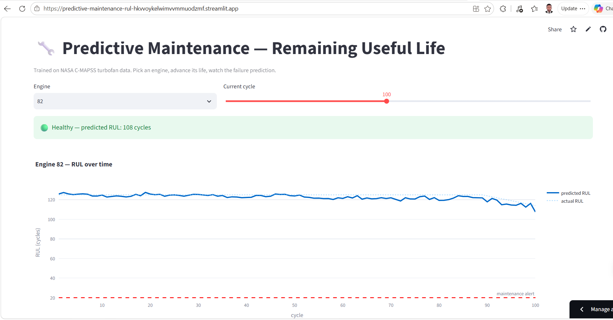
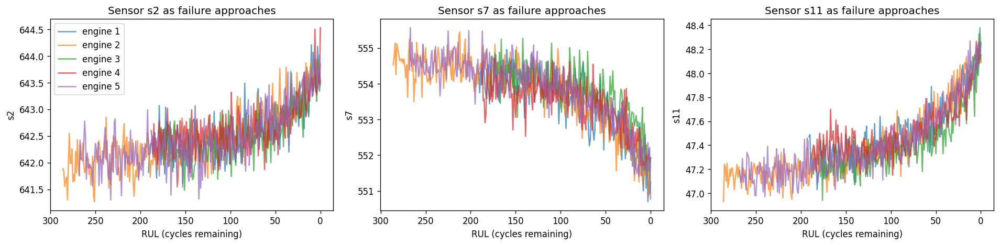
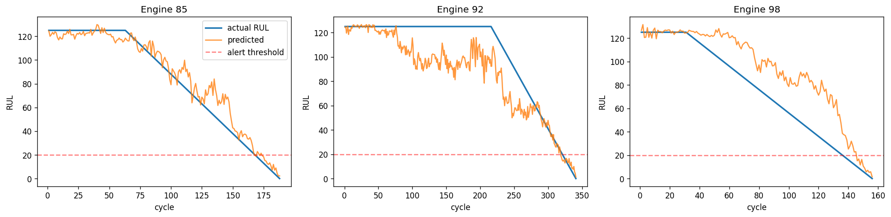

# Predictive Maintenance: Remaining Useful Life

A machine learning model that predicts how many operating cycles a machine has left before failure, trained on NASA's C-MAPSS turbofan engine dataset. A live dashboard lets you scrub through an engine's life and watch the prediction count down to a maintenance alert.

**Live dashboard:** https://predictive-maintenance-rul-hkvvoykelwimvvmmuodzmf.streamlit.app



## Why this project

Fixed maintenance schedules waste money in both directions. Service too early and you throw away useful machine life. Service too late and you eat an unplanned breakdown, which costs far more. Predictive maintenance replaces the fixed schedule with a question the data can answer: how much life does this specific machine have left, right now?

That number is called Remaining Useful Life (RUL). This project trains a model to estimate it from sensor readings, and raises an alert when predicted RUL drops below 20 cycles.

## The data

NASA's C-MAPSS dataset (FD001 subset) is the standard public benchmark for this problem: 100 simulated turbofan engines, each run from healthy condition to failure, with 21 sensor readings per cycle. Engine lifetimes range from 128 to 362 cycles, which is exactly why prediction matters. A fixed schedule tuned to the average engine would fail the short-lived ones and waste the long-lived ones.

The training set has no RUL column. It is constructed: every engine runs to failure, so for each row, RUL = final cycle minus current cycle. Building labels from run-to-failure data is the core trick of predictive maintenance ML.



The sensors drift as failure approaches. Noisy in any single reading, unmistakable in trend, which is why rolling window features beat raw values.

## The model

Gradient boosting regressor with rolling mean and rolling standard deviation features (10 cycle window) over the informative sensors. Two decisions matter more than the algorithm choice:

**RUL clipping at 125.** Early in life the sensors look identical whether an engine has 250 or 200 cycles left, because nothing is degrading yet. Capping the training target at 125 stops the model from being punished for failing to distinguish the indistinguishable. Standard practice on this benchmark.

**Splitting by engine, not by row.** Consecutive rows from one engine are near duplicates. A random row split would leak information between train and validation and inflate the score. Engines 1 to 80 train, engines 81 to 100 validate.

Seven sensors with near zero variance are dropped. Of the features that remain, rolling means dominate the importance ranking, confirming that the smoothed trend carries the signal.

## Results

Validation RMSE of about 19 cycles, MAE about 13, on held out engines. Published deep learning results on FD001 reach roughly 13 to 20 RMSE, so a one minute CPU training run with hand built features lands inside the credible range.



The operationally important behavior: predictions are noisy in mid life but converge on the truth near failure, crossing the maintenance threshold close to when the real RUL does. Being 15 cycles off at RUL 100 costs nothing. Being wrong about when RUL hits 20 is what schedules the repair truck.

## Components

| File | Purpose |
|---|---|
| `rul_prediction.ipynb` | Full workflow: data download, RUL label construction, exploration, feature engineering, training, evaluation. |
| `dashboard.py` | Streamlit dashboard: pick an engine, advance its life with a slider, watch predicted RUL and the alert status. |
| `app.py` | Gradio version of the same dashboard. |
| `rul_model.joblib`, `features.joblib` | Trained model and feature list (scikit-learn 1.9.0). |
| `val_data.parquet` | Validation engines used by the dashboard. |

## Run it yourself

```bash
git clone https://github.com/Marwuko/predictive-maintenance-rul.git
cd predictive-maintenance-rul
pip install -r requirements.txt
streamlit run dashboard.py
```

To retrain from scratch, open `rul_prediction.ipynb` in Colab. It downloads the dataset, builds features, trains, and exports the model.

## Roadmap

- [ ] Evaluate on the harder C-MAPSS subsets (FD002 to FD004, multiple operating conditions and fault modes)
- [ ] Compare against an LSTM baseline
- [ ] Probabilistic RUL (predict a range, not a point, so maintenance can plan against uncertainty)
- [ ] Feed simulated sensor streams from my [smart factory digital twin](https://github.com/Marwuko/smart-factory-digital-twin) through the model

## Related projects

This is the third piece of a smart factory portfolio:

1. [AI visual inspection](https://github.com/Marwuko/ai-visual-inspection): detect surface defects with YOLOv8 and log them to SQL
2. [Smart factory digital twin](https://github.com/Marwuko/smart-factory-digital-twin): simulate a production line and measure where it loses money with OEE analytics
3. This project: predict machine failures before they happen

Detect defects, measure losses, predict failures. Together they cover the quality, performance, and availability sides of running a factory.
